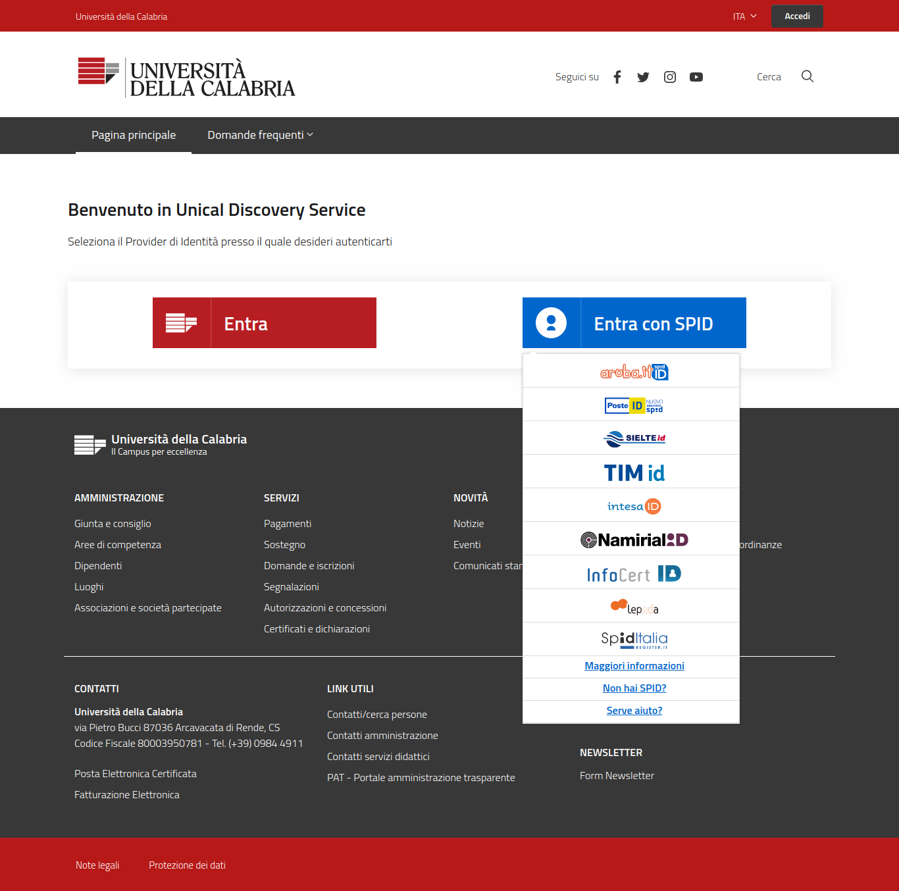
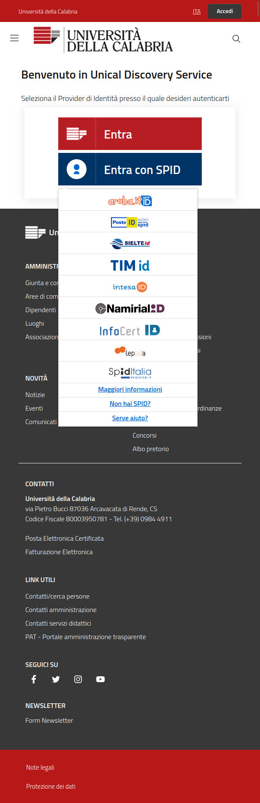
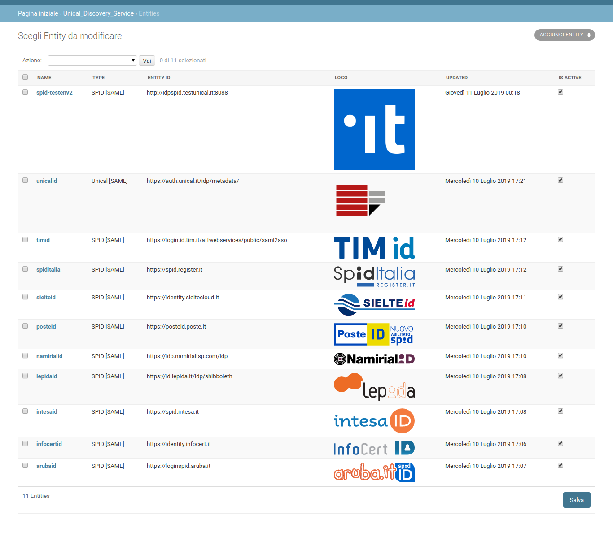

Discovery Service for Università della Calabria
-----------------------------------------------

Django Application for deployng a SAML Discovery Service with (or without) SPID access button.

Features
--------

- SPID button integration;
- Entities classification via admin backend;
- Based on Bootstrap Italia Unical Template;
- Discovery Service web resources compatible with [pyff](http://pyff.io/) resources:
  - /role/idp.ds
- [Brython](https://brython.info/) integration, Python 3 implementation for client-side web programming means that javascript was developed as `application/python`!


Example
-------

````
pip install -r requirements
# edit settingslocal.py.example to settingslocal.py

./manage.py migrate
./manage.py createsuperuser
./manage.py loaddata example/data/dumps/entities.json
````

Gallery
--------

_**Frontend**: Main page_

----



_**Frontend Mobile**: Mobile view_

----


_**Backend**: Classified Entities_
